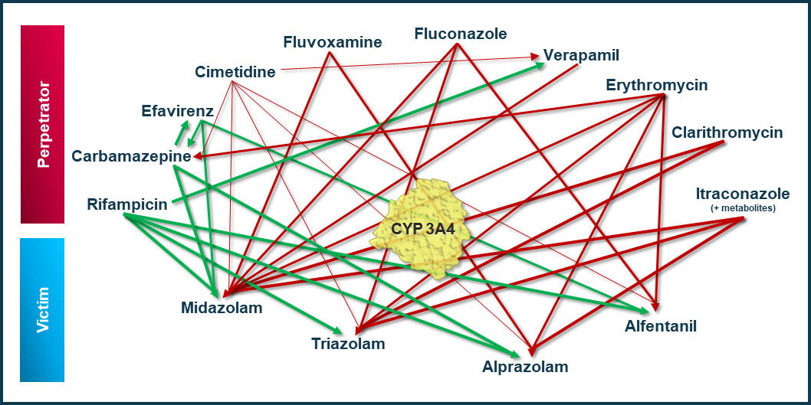

To qualify the OSP suite for the prediction of the CYP3A4 DDI potential of new drugs, a set of verified PBPK models of index perpetrators, covering the range from strong CYP3A4 induction to strong inhibition, and respective CYP3A4 DDI victim drugs is specified to set up a CYP3A4-mediated DDI modeling network. 

The following perpetrator compounds were selected: 

-	rifampicin (strong CYP3A4 inducer), 
-	efavirenz (moderate CYP3A4 inducer), 
-	fluvoxamine (weak/moderate CYP3A4 inhibitor), 
-	erythromycin (moderate CYP3A4 inhibitor), 
-	clarithromycin (strong CYP 3A4 inhibitor), 
-	itraconazole including metabolites (strong CYP3A4 inhibitor). 

The following sensitive CYP3A4 substrates as victim drugs were selected:

-	midazolam, 
-	triazolam, 
-	alprazolam,
-	alfentanil. 

**Figure 1** shows the prespecified and developed DDI modeling network of interacting perpetrator and victim drugs for the OSP suite qualification of predicting CYP3A4-mediated DDI.

**Figure** **1: CYP3A4 DDI modeling network**

The following sections give an overview of the clinical studies being part of this qualification report. The respective data identifier (DataID) refers to the **ID** of the dataset in the [OSP PK database](https://github.com/Open-Systems-Pharmacology/Database-for-observed-data).

